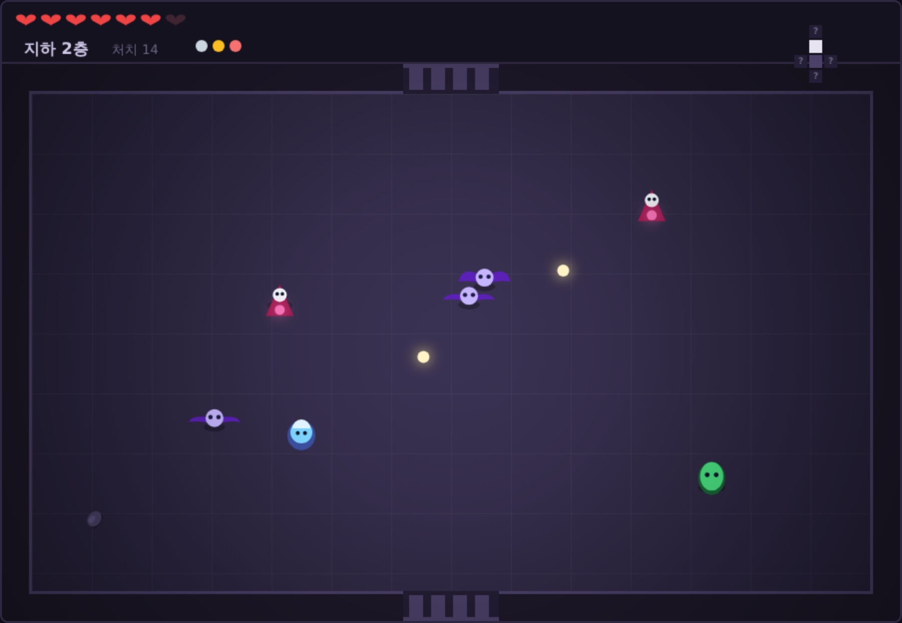
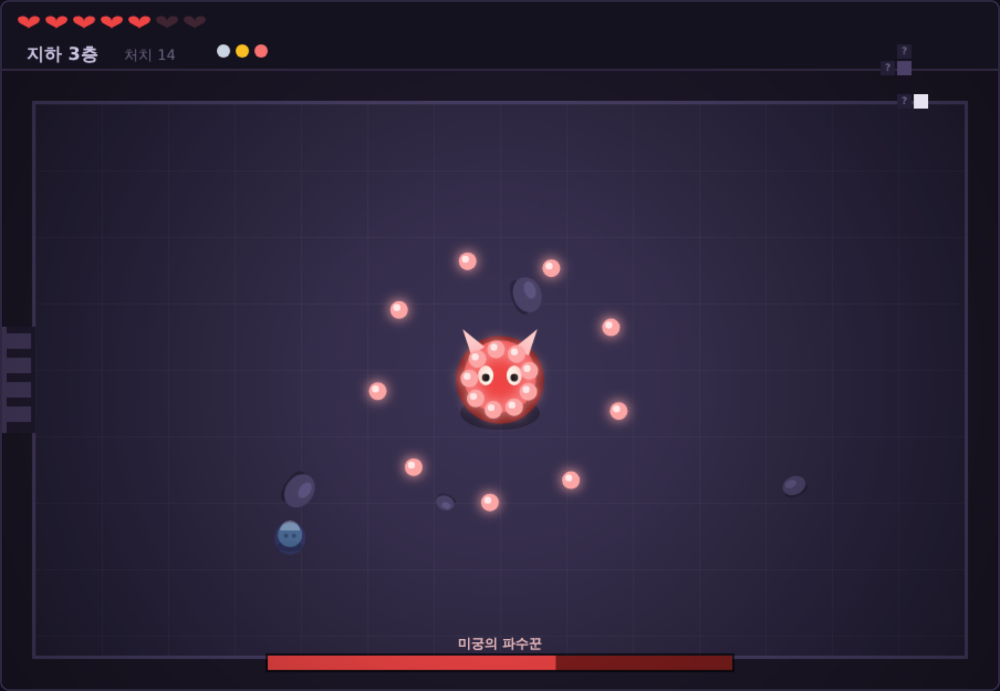

# 지하 미궁 (Cellar Depths)

방 단위로 이어진 던전을 탐험하는 2D 액션 로그라이크. 라이브러리 없이 순수 HTML + Canvas로 만든 단일 파일 게임이다.

**▶ [바로 플레이하기](https://hyeonwoo0504.github.io/cellar-depths/)**

## 실행 방법

위 링크로 바로 플레이할 수 있다. 로컬에서 돌리려면 `index.html`을 브라우저로 열면 끝 — 빌드도 서버도 필요 없다.

## 조작

| 키 | 동작 |
|---|---|
| `WASD` / 방향키 | 이동 |
| 마우스 클릭 | 조준 발사 |
| `IJKL` | 4방향 발사 |
| `R` | 재시작 |

모바일에서는 화면을 터치한 방향으로 발사된다.

## 게임 규칙

방에 들어가면 문이 잠기고, 적을 전부 쓰러뜨려야 다시 열린다. 각 층에는 보물방(★) 하나와 보스방(B) 하나가 있고, 보스를 잡으면 함정문이 열려 다음 층으로 내려간다. **지하 5층**까지 내려가면 클리어.

미니맵의 `?`는 아직 안 가본 방이다.

### 적

| 적 | 특징 |
|---|---|
| 슬라임 | 껑충껑충 접근. 쓰러뜨리면 작은 슬라임 둘로 갈라진다 |
| 박쥐 | 불규칙하게 흔들리며 빠르게 날아온다 |
| 해골 술사 | 거리를 유지하면서 탄을 쏜다 (2층부터) |
| 석상 수호병 | 체력이 높고, 가까워지면 돌진한다 (3층부터) |
| 미궁의 파수꾼 | 보스. 방사형 탄막과 돌진을 번갈아 쓰고, 체력이 절반 아래로 떨어지면 탄막이 두꺼워진다 |

### 아이템

보물방 좌대에서 하나씩 얻는다. 공격력, 공격 속도, 이동 속도, 최대 체력, 탄속·사거리, 그리고 탄환이 두 갈래로 갈라지는 「쌍둥이 눈」까지 6종.

## 구현 메모

### 던전 생성

*The Binding of Isaac*의 층 생성 방식을 참고했다. 9×8 격자 위에서 시작 방부터 너비 우선으로 뻗어나가되, **이웃이 2개 이상인 칸에는 방을 놓지 않아** 고리 모양 통로가 생기지 않게 한다. 목표 방 개수를 채우면 멈추고, 못 채우면 처음부터 다시 시도한다 (최대 120회).

방이 다 놓이면 시작 방에서 BFS로 거리를 재서:

- 문이 1개뿐인 **막다른 방** 중 가장 먼 곳 → 보스방
- 가장 가까운 곳 → 보물방

극히 드물게 랜덤 생성이 모두 실패하면 일자형 복도 레이아웃으로 대체해, 어떤 경우에도 플레이 가능한 층이 나온다.

### 그 외

- 렌더링은 Canvas 2D 하나. 모든 캐릭터는 도형 조합으로 그렸고 이미지 에셋이 없다
- 피격 시 화면 흔들림·플래시·넉백, 적 처치 시 파티클
- 방 입장 직후 0.7초 무적 — 문 앞에 적이 있어도 즉사하지 않는다
- 적끼리 서로 밀어내서 한 점에 겹치지 않는다

## 기술

HTML5 Canvas · 바닐라 JavaScript · 의존성 0개 · 단일 파일 (약 50KB)

## 테스트

Playwright로 19개 항목을 검증했다 — 던전 생성 1000회 무예외, 전 층 보스/보물방 존재, 모든 방 도달 가능성, 문 연결 양방향 대칭성, 벽 충돌, 방·층 이동, 적 스폰과 클리어 판정, 아이템 효과 적용, 장시간 플레이 안정성.

브라우저 콘솔에서 `__DUNGEON__`으로 게임 상태에 접근할 수 있다.

## 라이선스

MIT
